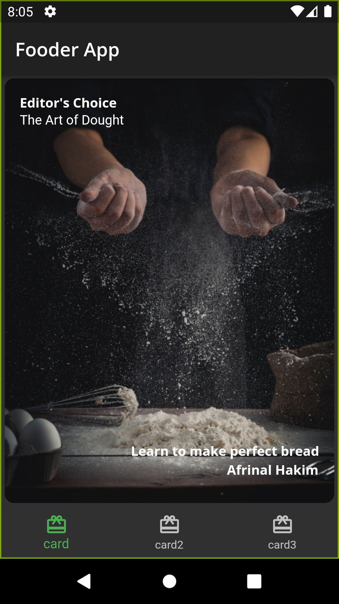
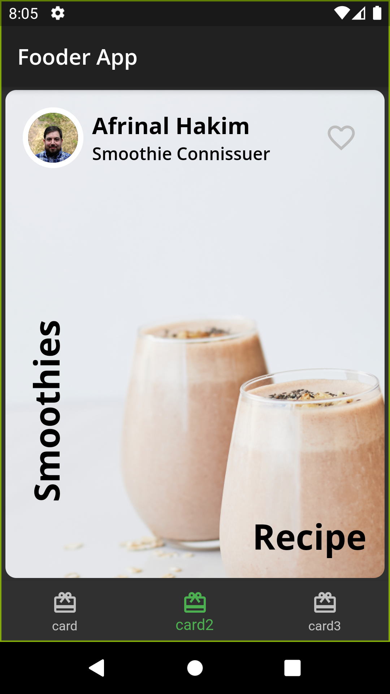
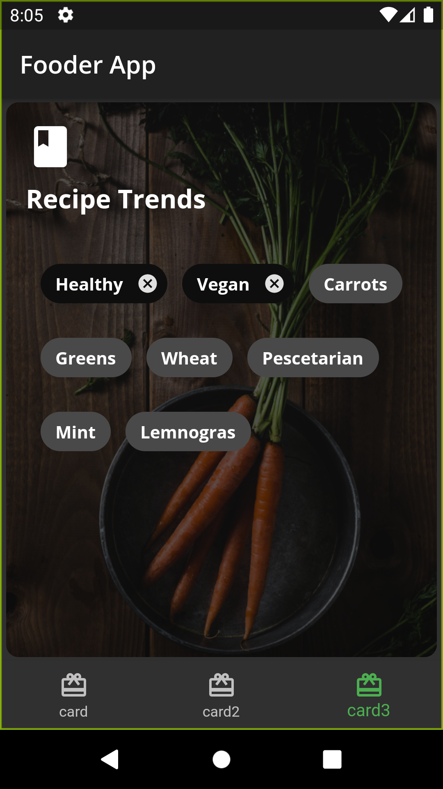

<!-- ABOUT THE PROJECT -->
## About The Project
   

<!-- GETTING STARTED -->
## Getting Started

This is an example of how you may give instructions on setting up your project locally.
To get a local copy up and running follow these simple example steps.
